  

  Привет! 👋 Мне 20, я студент бакалавриата по направлению "Прикладная математика и информатика".  
  Увлекаюсь наукой и коммерческой разработкой, особенно на Python, и особенно -   
  в областях Data Science, Machine Learning, и Back-end. Также интересна сфера System Analytics.  
  Всегда открыт к новым знаниям и интересным проектам!

---

### 💻 С чем имею опыт взаимодействия

**Любимки:**

  
  
  
  
  
  
  
  

 

  
  
  
  
  
  

**Языки и технологии:**

  
  
  
  
  
  
  
  
  
  

 

  
  
  
  
  
  
  
  
  
  

 

  
  
  
  

**Инструменты и ПО:**

  
  
  
  

 

  
  
  
  

 

  
  
  
  

 

  
  

 

  
  

**Стандарты:**

  
  
  

---

### 📊 Статистика

<!-- Combined  -->

  <table border="0" cellpadding="0" cellspacing="0">
    <!-- Gen Stats, Streak, Achievements -->
    <tr>
      <td rowspan="2" valign="center" style="padding-right: 10px;">
        
      </td>
      <td valign="center">
        
      </td>
    </tr>
    <tr>
      <td valign="center" style="padding-top: 10px;">
        
      </td>
    </tr>
    <!-- LeetCode, Codewars, Langs -->
    <tr>
      <td rowspan="2" valign="center" style="padding-right: 10px;">
        
      </td>
      <td valign="center">
        
      </td>
    </tr>
    <tr>
      <td valign="center" style="padding-top: 10px;">
        
      </td>
    </tr>
  </table>

---

### 🌱 Где черпаю знания

  
  
  
  
  
  
  
  
  
  

  
  
  
  

---

### 🎵 Увлечения

  &nbsp &nbsp &nbsp &nbsp Помимо кода, я большой поклонник музыки - люблю слушать разнообразные жанры и сам немного пишу.  
  Из доступного публике - наковырял саунд-дизайн и написал заглавную тему для 2D-платформера <a href="https://ewepu.itch.io/bobby-adventures" target="_blank" rel="noreferrer">bobby adventures!</a>  
  Также пишу стишки в стол и охочусь с камерой за интересными видами в мегаполисе😁  
  Могу назвать себя ценителем планеты Земля?..

  
---

    
  <picture>
    <source media="(prefers-color-scheme: dark)" srcset="dist/github-snake-dark.svg" />
    <source media="(prefers-color-scheme: light)" srcset="dist/github-snake.svg" />
    
  </picture>  
  

